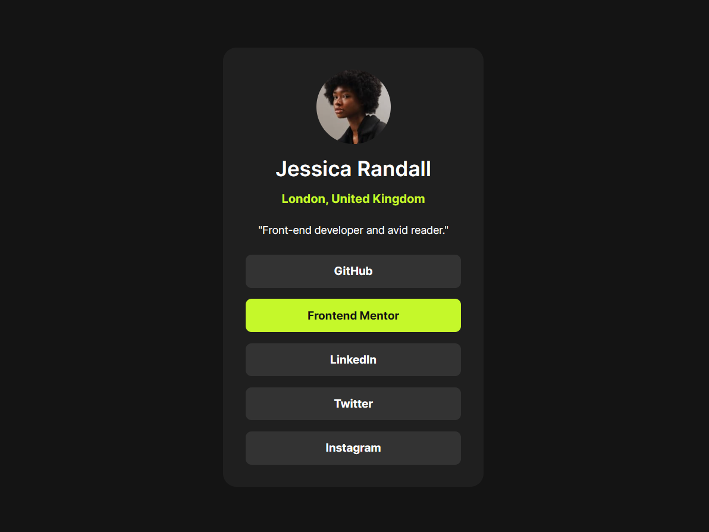

# Frontend Mentor - Social Links Profile Solution

Esta é a minha solução para o desafio [Social Links Profile](https://www.frontendmentor.io/challenges/social-links-profile-UG32l9m6dQ) do Frontend Mentor. Os desafios do Frontend Mentor ajudam desenvolvedores a aprimorar suas habilidades construindo projetos realistas.

## O desafio

O objetivo era criar um perfil de rede social simples, com links clicáveis para diferentes plataformas, garantindo:

- Estrutura semântica e limpa  
- Layout responsivo  
- Hover states em botões interativos  

---

### 📷 Preview do projeto

### 🔗 Links

- **Site ao vivo:** [Clique aqui](https://glssv.github.io/Social-Links-Profile/)  
- **Repositório no GitHub:** [Clique aqui](https://github.com/Glssv/Social-Links-Profile)

---

### 🛠️ Tecnologias utilizadas

- HTML5 semântico  
- CSS3 (custom properties e hover/transitions)  
- Flexbox para alinhamento e distribuição de espaço  
- Fonte *Inter* importada localmente via `@font-face` (não depende de CDN)

---

### ✨ Aprendizados & Experimentos

Neste projeto, trabalhei em:

- Organização do HTML semântico para um card único de perfil  
- Uso de Flexbox para alinhar elementos verticalmente e distribuir espaços  
- Criação de botões responsivos e hover states usando links (`a`) dentro de `li`  
- Customização de fontes usando `@font-face`  

---

### 🚀 Próximos passos

- Explorar animações e microinterações mais avançadas
- Criar variações do card para diferentes layouts e dispositivos
- Aprofundar no uso de Flexbox e Grid para componentes mais complexos

## 🙋‍♀️ Autora

### Gracielle Souza – Desenvolvedora Full Stack em formação, apaixonada por front-end, desafios e explorar novas possibilidades.

**Perfis:**

- 👩‍💻 Frontend Mentor – [@Glssv](https://www.frontendmentor.io/profile/Glssv)
- 🐙 GitHub – [@Glssv](https://github.com/Glssv)
- 💼 Linkedin – [Gracielle Souza](https://www.linkedin.com/in/gracielle-souza/)

---

  
  
Desenvolvido com 💜
 

